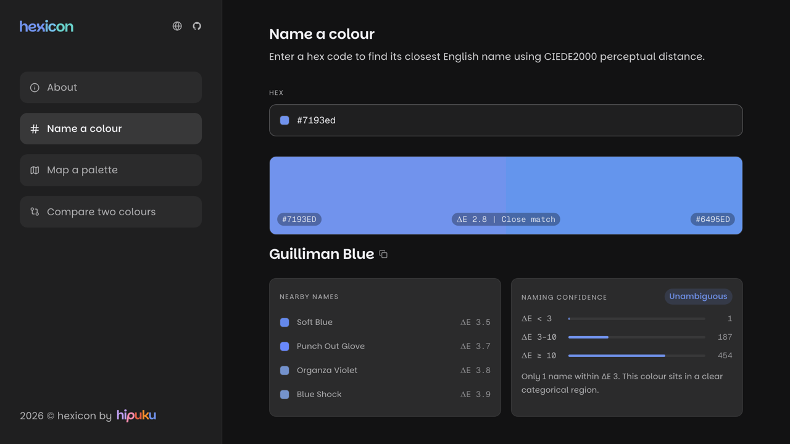

# hexicon



Perceptual colour tools in the browser. Live at [hexicon.hipuku.dev](https://hexicon.hipuku.dev).

## Tools

- **Name** a colour: the closest of 31,900 names, by CIEDE2000.
- **Map** a palette: OKLCH lightness, chroma and hue, and a WCAG contrast matrix.
- **Compare** two colours: their CIEDE2000 distance, shown in context.

## Stack

React 19, TypeScript, Vite, Tailwind CSS v4, [kern](https://github.com/hipuku/kern), [haus-colour-utils](https://www.npmjs.com/package/haus-colour-utils), chroma-js.

## Development

```bash
npm install
npm run dev
```

`npm test`, `npm run lint` and `npm run typecheck` run the checks CI runs.

## Licence

MIT. The colour names come from [meodai/color-names](https://github.com/meodai/color-names), MIT, © 2017 David Aerne; its licence is in `src/lib/colornames.LICENSE`.
